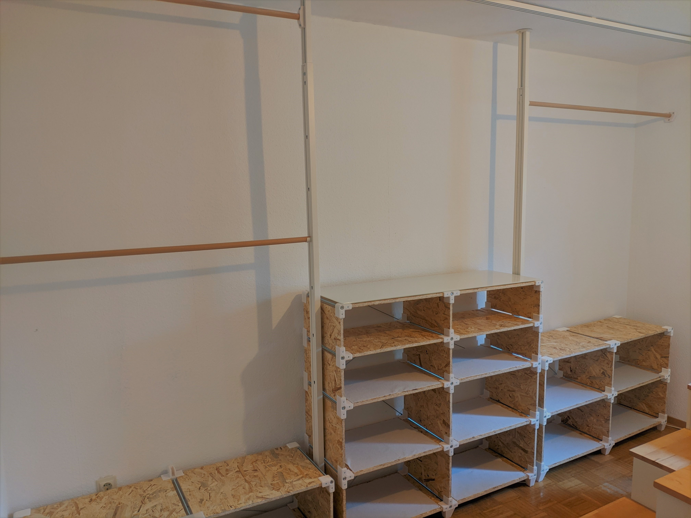
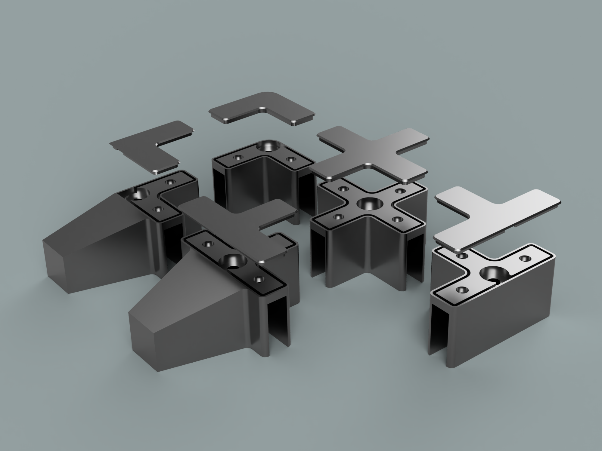

# modular_shelving_system

repository for a shelving system based on common hardware components and 3d-printable connectors.
The files are designed for the usage of boards with a thickness of 15mm and M8 hardware. 

## parts:

The system is based on 3 basic components:

* **corner:** creating an 90° angle between two boards
* **line:** connectiing three boards right-angled
* **cross:** forming the center of four boards 

Additionally there exist versions of *corner* and *line* as the feet of the shelve.

For each ***_body** component a ***_lid** is provided, to cover the open front of the parts.

## additionally needed components:

For each pair (front and back) of printed connectors a M8 threaded rod and two **_low-profile_** (5mm thickness) M8 nuts are needed.
Additionally there are holes for pan-head chipboard screws (I used 4,5x40mm) to increase the stability of the construction. Although not essential I highly recommend to use these.

* **2** screws _per_ corner- or corner-foot-connector
* **3** screws _per_ line- or line-foot-connector
* **4** screws _per_ center-cross

I also recommend to use some cross-braces on the back of the shelves to increase horizontal stability. The ones from IKEA ([link](https://www.ikea.com/us/en/p/observatoer-cross-brace-galvanized-87749600/)) are a cheap option for this.

## extra parts:

I've included two additional parts in this repository to mount a clothing rail.

* **wallmount** (*_main* and *_clamp) can be screwed against a wall to hold a rod with 25mm diameter
* **mount_elvarli** is intended to be mounted onto a [IKEA elvarli post](https://www.ikea.com/us/en/p/elvarli-post-white-40296170/)) (again for 25mm rods)

## printing advise:

I printed my parts with a 0.6mm nozzle at a layerheight of 0.3mm and an infill of 25% in regular PLA. I printed with at least 4 perimeters, this increases the strenght of the parts more than going crazy with the infill.
With the cross-braces preventing sidewise movement, my shelf easily holds 60kg.

While normal connectors can be printed directly, one part in each foot-pair has to be mirrored. I recommend printing the *_body* parts with support-material and the "open" side orientated towards the build
plate. This way the top of the parts aren't smashed into the build-plate and the lids fit more easily.

